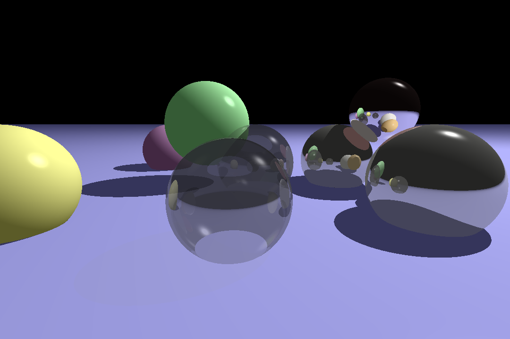
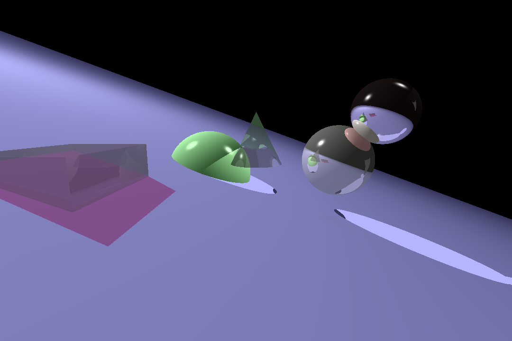
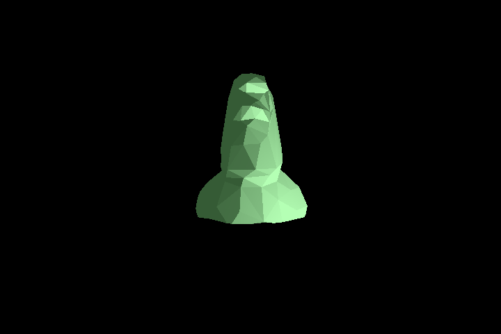
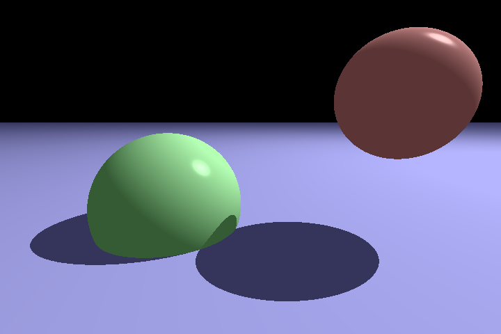

# Raytracer
A simple raytracer written in C++ that can generate a realistic image from a config file.

# Supported Features:
## Primitives:
- Spheres
- Planes
- Triangles
- cones and limited cones
- cylinders and limited cylinders
- obj files
- cubes

## Lighting:
- Ambient lighting
- Point lights
- Directional lights

## Shading:
- Diffuse shading
- Specular shading
- Reflections
- Drop shadows
- Refraction

## Transformations:
- Translation
- Rotation
- Scaling
- Shearing

## Processing:
- Anti-aliasing
- Phong reflection model
- Blinn-Phong reflection model

# Usage:
## Compiling:
This project uses CMake to compile. To compile, run the following commands:
```
cmake -S . -B build
cmake --build build
```

## Running:
To run the program, run the following command:
```
./raytracer
```

## Config File:
The config file used to generate the image is located at the root of the project and is called `config.cfg`. The config file is a text file that contains all the information needed to generate the image. The config file is divided into sections, each section containing information about a specific aspect of the image. The sections are as follows:
- `camera`: Contains information about the camera used to generate the image.
- `primitives`: Contains information about the primitives in the scene.
- `lights`: Contains information about the lights in the scene.
- `materials`: Contains information about the materials used in the scene.
- `AntiAliasing`: Contains information about the anti-aliasing used in the scene.

# Examples:




